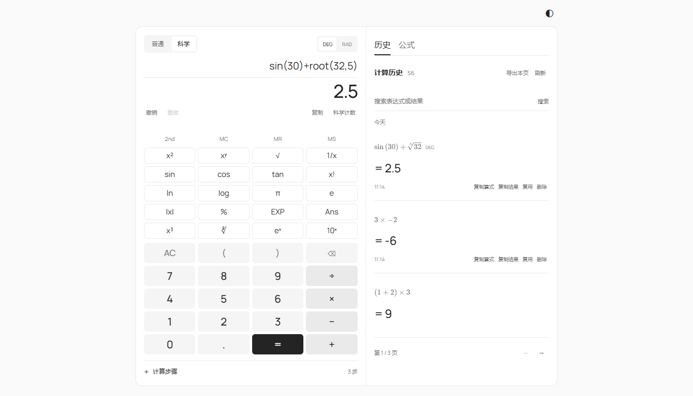

# 计算器前端

**简体中文** | [English](README.en.md)

支持普通与科学计算的响应式网页计算器，采用黑白灰界面，提供键盘输入、浅色/深色主题、逐步化简、历史记录和共享公式库。所有计算由后端执行。

[在线体验](https://calculator.assignment1.workers.dev) · [后端仓库](https://github.com/HX-Jan/calculator-backend) · [部署说明](https://github.com/HX-Jan/calculator-backend/blob/main/cloudflare/README.md)



技术栈：HTML、CSS、JavaScript（ES modules）和 Vite；字体随静态资源本地打包。

## 项目信息

负责人：[洪翔 / HX-Jan](https://github.com/HX-Jan)，负责需求规划、界面方案和功能迭代方向。[开发说明](docs/DEVELOPMENT.md)

## 本地运行

需要 Node.js 22.12 或更高版本（已使用 Node 24 验证），后端默认运行在 8000 端口。

```powershell
npm ci
Copy-Item .env.example .env
npm run dev
```

打开 http://127.0.0.1:5173 。macOS/Linux 使用 `cp .env.example .env`。

`VITE_API_BASE_URL` 在开发环境默认为 `http://127.0.0.1:8000`，生产环境默认为网站同源地址。独立部署 API 时，在启动或构建前修改 `.env`，并在后端的 `ALLOWED_ORIGINS` 中允许前端来源。

前端不创建数据库。历史和公式来自后端数据库；主题、计算模式和角度偏好保存在 localStorage。

## 计算功能

- 普通/科学模式切换会记住选择，保留输入和结果；DEG/RAD 切换会清除旧结果，需要重新计算。
- 支持四则、小数、括号、一元正负号、平方、立方、乘方、倒数、阶乘、百分号、π 和 e。乘号必须明确输入。
- 科学键盘通过 2nd 切换两页：三角及反三角函数、双曲及反双曲函数、根、对数、abs、exp、floor/ceil 等。
- 双参数窗口支持 `root(x,n)`、`logbase(x,b)`、`mod(x,y)`、`perm(n,r)`、`comb(n,r)`；确认生成算式，按等号计算，取消保持原输入。
- `sin(30)` 在 DEG 下为 `0.5`，`sin(pi/2)` 在 RAD 下为 `1`。反三角函数遵循角度单位，双曲函数不使用角度单位。
- EXP 输入科学计数法，如 `1.2E-3`，也接受小写 e。常量 e 单独使用，需显式乘法。
- 百分号固定除以 100：`200+10% = 200.1`，`200*10% = 20`。
- 阶乘接受 0–69 的整数；排列组合接受 `0 ≤ r ≤ n ≤ 1000` 的整数。负数只支持整数奇次根，结果仍受后端范围限制。

仅支持实数，不含矩阵、复数、方程求解或统计模块。三角、反三角、双曲及反双曲函数采用约 15 位有效数字的近似计算；根和对数也可能舍入。非法定义域不会保存历史。

## 输入与结果

输入算式或点击按键，Enter 计算，Escape 清空输入。成功后输入数字、小数点或常量开始新算式；输入运算符从当前结果继续计算。点击输入框或移动光标后可编辑原算式。未修改时连续按等号不重复提交或保存。

函数键优先包裹选区，否则包裹光标前完整操作数；没有操作数时插入成对括号。结果状态下，平方、立方、倒数和正负号直接提交后端计算。自动补全的右括号可跳过，空括号对可一起退格删除；普通文本输入不强行补括号。

Ans 插入上次成功结果；MS 存储当前结果、MR 读取、MC 清除。Ans 和存储只保留在当前页面会话，AC 不清除存储。复制、Ans、存储及连续计算始终使用原始结果字符串。科学计数显示不使用 JavaScript 浮点数；长数复用转换为等值科学计数输入。

请求期间禁用冲突操作。网络或计算失败保留输入，并清除旧结果和步骤；历史刷新失败会标记数据可能过期。

## 错误定位与撤销

表达式错误选中相关字符；缺少内容时定位到插入位置。修改或撤销会清除旧标记，重新计算由后端验证。

支持最近 100 步撤销/重做，包括清空、粘贴、函数包裹及选区替换。快捷键为 Ctrl+Z、Ctrl+Y 或 Ctrl+Shift+Z，macOS 使用 Command。新编辑清除重做分支，刷新页面清空编辑栈。撤销恢复表达式、光标和自动括号，不删除数据库历史或改变存储值，也不自动计算。

## 步骤与历史

步骤默认折叠，展开后显示编号、运算名称、算式前后变化及当前部分高亮；三角及反三角步骤显示 DEG/RAD。步骤可能包含舍入值，最后一步与结果一致。长算式在区域内横向滚动，可键盘聚焦。旧后端缺少轨迹字段时回退到原步骤列表。

历史按本地日期分组，支持搜索、每页 20 条分页、复制和确认删除。复用只填入算式，需按等号重新计算；科学表达式复用恢复科学模式与原角度单位。清除搜索返回第一页。

“导出本页”下载当前已加载的最多 20 条记录，包含 ID、表达式、结果、角度单位及 UTC 时间。CSV 使用 UTF-8 BOM；表达式和结果带单引号文本前缀，避免表格软件执行公式或舍入长数字。复制按钮提供原始文本。空结果、加载中或读取失败时不能导出，导出不修改数据库。

历史与自定义公式由所有访问者共享，没有账号或私有数据。

## 共享公式库

历史/公式切换默认显示历史。内置圆面积、圆周长、勾股定理和二次函数求值；内置项只读，可另存为自定义项。自定义项支持新增、名称搜索、编辑和确认删除。

公式列表、参数窗口和编辑预览采用 [KaTeX](https://katex.org/docs/api) 数学排版，显示 π、上标、根号、分式和对数下标。排版库及字体随网站打包，不依赖外部 CDN。编辑和保存仍使用原表达式，例如 `pi*r^2`；展示时省略乘号不代表输入支持隐式乘法。

公式名称和参数标签最多 40 字，表达式最多 500 字符。参数为最多 8 个单独小写字母，排除 e，pi 和函数名保留，不支持隐式乘法。点击“识别参数”设置中文名称；保存也会识别参数，只校验语法，因此 `1/x` 可以保存。

使用时参数可填 `-3`、`1/3`、`sqrt(2)` 等，不能引用其他参数。本次 DEG/RAD 对所有参数及公式生效。后端将每个参数表达式加括号代入，总长度仍限制 500 字符；成功后主界面显示完整算式、结果和步骤，历史保存代入式。

参数错误显示在对应字段，整体错误显示在窗口底部，失败保留输入。自定义公式使用更新时间检查冲突，被他人修改后需刷新并重新打开。删除公式不影响历史。请求期间禁用重复提交和关闭窗口，网络恢复后可重试。公式库需要支持公式接口的新版后端。

## 项目结构

| 文件 | 职责 |
|---|---|
| `src/main.js` | 状态、请求、键盘与历史交互 |
| `src/api.js` | JSON 请求及错误处理 |
| `src/expression-editor.js` | 光标、选区、自动括号、撤销/重做 |
| `src/result-view.js` | 原始结果字符串与科学计数显示 |
| `src/steps-view.js` | 后端步骤及 UTF-16 范围高亮 |
| `src/history-utils.js` | 日期分组与当前页 CSV 导出 |
| `src/formula-library.js` | 公式列表、编辑与代入窗口 |
| `src/formula-notation.js` / `src/formula-view.js` | 表达式转换为数学排版；不执行计算 |
| `src/style.css` / `index.html` | 响应式主题与无障碍控件 |

普通服务器文本通过 `textContent` 渲染；公式仅将受限语法转换为数学排版，关闭 KaTeX 的可信链接功能。不完整表达式回退为文本。变量识别、参数校验和计算仍由后端完成。

## 检查与构建

```powershell
npm run check
npm test
npm run build
npm run preview -- --port 5173
```

同端口预览前需停止开发服务。后端测试在配套仓库。浏览器检查覆盖 `0.1+0.2`、`(1+2)*3`、`3*-2`、非法输入、除零、持久化、历史操作、主题和手机布局；后端断开时不能生成新结果。

## 部署与验证

前端由 Workers Static Assets 提供，与 Python API 同源，D1 保存数据。从后端仓库的 `cloudflare` 目录构建部署。`VITE_*` 配置公开可见，不能存放密码或登录凭据。GitHub Actions 运行检查，不自动部署。

截至 2026-10-04，后端 CI 234 项通过，覆盖率 98%；前端 18 项测试、语法检查及构建通过。界面更新已部署到现有 calculator Worker，D1 绑定保持不变；公网访问不在本轮复查范围。

桌面布局以 1366×768 为目标，手机主要按钮至少 44px，历史位于计算器下方。使用本地打包字体，许可证见 `public/licenses`。

补充文档：[功能与验证记录](docs/VERIFICATION.md) · [设计说明（英文）](DESIGN.md) · [结构与功能图（英文）](docs/OVERVIEW.md)

输入框中的乘除运算统一显示为 `×`、`÷`；键盘输入或粘贴的 `*`、`/` 会自动转换。历史复用、函数插入及撤销重做保持相同显示。后端继续兼容两种写法。2026-10-05 历史列表和删除确认使用与公式库相同的数学排版，显示 π、上标、根号、多次方根和分式；历史复用填回可编辑的表达式；复制及 CSV 导出保留原始表达式。更新后前端 20 项测试、语法检查和构建通过，项目预览截图已更新。
