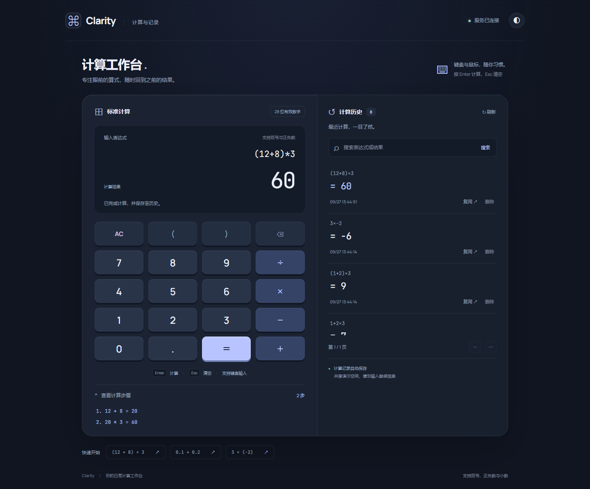

# Clarity Calculator Frontend

A responsive calculator interface with keyboard input, light/dark themes, server-provided calculation steps, and searchable paginated history.

The redesigned interface uses a midnight-blue instrument enclosure, raised keycaps and locally bundled Manrope / JetBrains Mono fonts. Dark mode is the new default; the theme button switches to a matching light palette. See [design decisions](DESIGN.md). Font licenses are included in `public/licenses`.



配套后端：[calculator-backend](https://github.com/HX-Jan/calculator-backend)。本项目由 AI 辅助实现与测试；请理解交互与接口代码，并按课程要求声明辅助范围。

## Run locally

Requires Node.js 22.12+ (tested with Node 24) and the backend on port 8000.

```powershell
npm install
Copy-Item .env.example .env
npm run dev
```

Open http://127.0.0.1:5173. On macOS/Linux use `cp .env.example .env`. For repeatable installation after cloning, use `npm ci`.

`VITE_API_BASE_URL` defaults to `http://127.0.0.1:8000`. Set it in `.env` before starting or building. The backend must allow the frontend origin through `ALLOWED_ORIGINS`.

The frontend does not initialize a database. Start the backend; it creates its database table. Calculation results and history are retrieved through HTTP. Only theme preference is stored in localStorage.

## Use

- Type an expression or use the keypad. Enter computes; Escape clears the input.
- Supports `+ - * /`, UI `× ÷`, decimal numbers, parentheses and unary signs.
- Expand the steps below the keypad to see backend evaluation order.
- Search expression/result history; use arrows to move through 20-row pages.
- Reuse copies an expression into the input without computing it. Press Enter to compute again.
- Delete asks for confirmation and then sends the record id to the backend.
- The history is shared demo data. This version has no accounts or private histories.

## Architecture

`src/api.js` manages JSON HTTP requests and errors. `src/main.js` manages input, loading states, safe DOM rendering and history interactions. `src/style.css` implements responsive themes. `index.html` uses semantic form controls and accessible names.

The frontend never evaluates expressions or computes final results. Results remain strings, avoiding JavaScript numeric rounding. Server-provided text is inserted with `textContent`, not HTML injection. Pending calculation requests disable conflicting input. Failed history refreshes are explicitly marked as potentially stale.

## Build and verification

```powershell
npm run check
npm run build
npm run preview -- --port 5173
```

Stop the development server before previewing on the same port. Backend tests live in the backend repository. Manual browser acceptance: verify `0.1+0.2`, `(1+2)*3`, `3*-2`, invalid input, zero division, refresh persistence, record deletion, search, pagination, theme persistence and mobile layout. Stop the backend and confirm the UI cannot create a new result.

## Deployment by the owner

Create a Render Static Site connected to this repository. Build command: `npm ci && npm run build`; publish directory: `dist`. Set `VITE_API_BASE_URL` to the backend HTTPS origin, then rebuild. Set the backend `ALLOWED_ORIGINS` to this site's origin. Public deployment is not automatically performed by this repository upload.

Do not put database passwords in `VITE_*` variables: they are public client-side configuration. See [Render static sites](https://render.com/docs/static-sites) and [code standards](codestyle.md).
