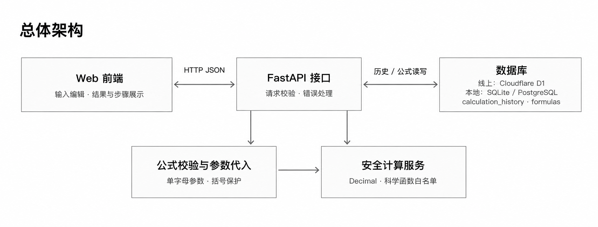
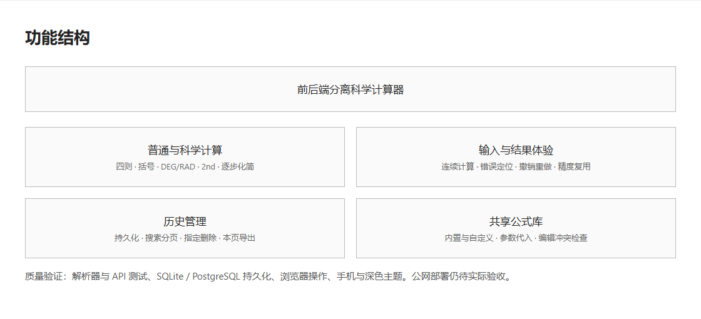

# Current project overview

Updated: 2026-10-04. The calculator supports basic/scientific modes, safe backend evaluation, persistent history, expression editing with undo/redo, step-by-step traces and a shared formula library.

- [Frontend](https://github.com/HX-Jan/calculator-frontend)
- [Backend and API contract](https://github.com/HX-Jan/calculator-backend)
- [Verification](VERIFICATION.md)

## Architecture

## Features

## Calculation and persistence

The frontend never evaluates expressions. Formula parameters and calculations are handled by the backend; results remain strings. History and custom formulas are shared by all visitors without accounts. Successful calculations are committed before returning success. Public hosting uses Cloudflare Python Workers, Static Assets and persistent D1 storage. The API has been verified; access depends on the visitor's network. This overview does not claim the coursework blog has been published.
